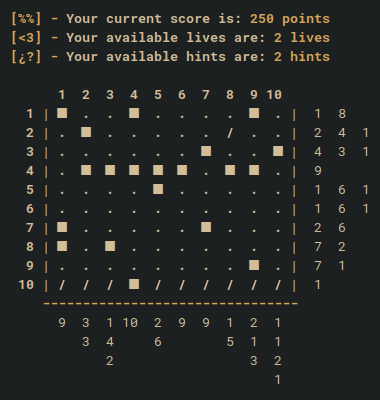

<div align="center">

# Nonogram Game
</div>
This project is a terminal-based implementation of the Nonogram puzzle game. It includes features such as generating Nonogram grids, providing hints, marking cells, and checking if the puzzle is solved. The game is designed to be played in a terminal with various difficulty levels and color-coded outputs.

<div align="center">

## Images
</div>

### Terminal Mode:

- Welcome to the game!
<div align="center">
    
</div>

- Have lots of fun!
<div align="center">
    
</div>

- You don't have any hints!
<div align="center">
    
</div>

- You'ar DEAD!
<div align="center">
    
</div>

## Features

- **Nonogram Grid Generation**: Automatically generates Nonogram grids of different sizes.
- **Hint System**: Provides hints to help solve the puzzle.
- **Marking Cells**: Allows marking cells as filled or hollow.
- **Difficulty Levels**: Offers multiple difficulty levels, including a hard mode with no hints.
- **Terminal-Based UI**: Uses a terminal-based user interface with color-coded outputs for better visualization.


## How to Run

You need to have installed:
- [ant](https://ant.apache.org/)
- [java](https://www.oracle.com/java/technologies/downloads/)

Before that you can run:
1. **Clone the repository**:
    ```sh
    git clone https://github.com/yourusername/nonogram-game.git
    cd nonogram-game
    ```

2. **Build the project**:
    ```sh
    ant compile
    ```

3. **Run the game**:
    ```sh
    ant run
    ```
4. **Clean the .class files**:
    ```sh
    ant clean
    ```
## How to Play

1. **Start the game**: Run the game and follow the prompts to enter your name and select a difficulty level.
2. **Mark cells**: Use the terminal interface to mark cells as filled or hollow.
3. **Hints**: Use hints if available to help solve the puzzle.
4. **Solve the puzzle**: Continue marking cells until the puzzle is solved.

## Class Diagram
The Terminal mode class diagram was intended to be designed with the Model View Controller pattern!
<div align="center">
    
</div>


## Repository
If you want to see the repository of my Github and search my jobs with my user called "[AxoltDash](https://github.com/AxoltDash)", you can follow this [LINK](https://github.com/AxoltDash/nonogram) or scan the following QR (click on it):
<div align="center">
    <a href="https://github.com/AxoltDash/nonogram">
        
    </a>
</div>

## Upcoming Features

In the next few days, a graphical interface mode will be added to enhance the user experience.

## License

This project is licensed under the MIT License. See the LICENSE file for details.